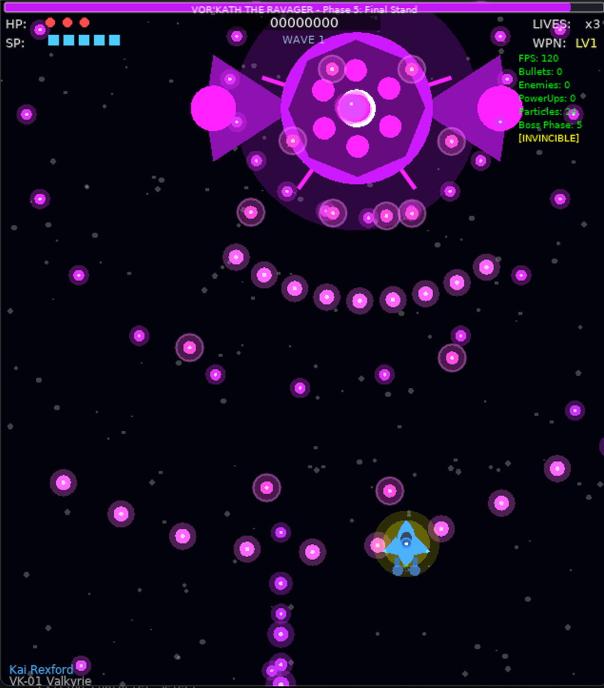

# Shmup

A vertical scrolling shoot-em-up (shmup) powered by Love2D, featuring intense mecha combat against the Tau Deu alien invasion.



## Game Features

### Core Gameplay
- **3 Unique Pilots**: Choose from Kai "Valkyrie" Rexford, Zara "Phantom" Nakamura, or Viktor "Bastion" Kozlov, each with distinct stats and weapons
- **Character-Specific Weapons**: Each pilot has unique shooting patterns that evolve with power-ups
- **Focus Mode**: Hold SHIFT to slow down and reveal your hitbox for precision dodging
- **Wave-Based Combat**: Survive increasingly difficult waves of enemies
- **Boss Battles**: Face off against massive bosses every 3 waves

## Controls

- **WASD / Arrow Keys**: Move your ship
- **SPACE / Z**: Fire weapons
- **LSHIFT / RSHIFT**: Focus mode (slow movement)
- **ESC**: Pause game / Resume
- **Q** (while paused): Quit to main menu

### Debug Controls (F3 to enable)
- **F3**: Toggle debug overlay (FPS, entity counts, boss HP)
- **I**: Become invulnerable
- **X**: Extra fire power

## Running the Game

```bash
cd games/mecha-shmup
love .
```