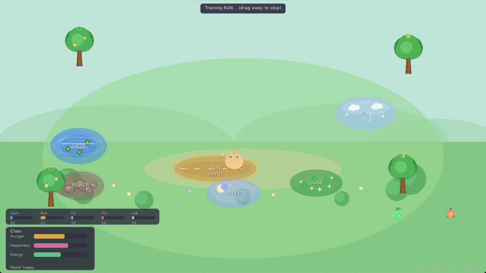

# VPet Garden

A cozy virtual pet demo built with [Love2D](https://love2d.org/) (11.4+). Tend to your Chao companion — feed it, pet it, train it, and keep it happy.



## Run

```bash
cd games/vpet-garden
love .
```

## How to Play

| Action | How |
|---|---|
| **Pet** | Click the Chao |
| **Drag** | Click & hold the Chao (~0.2s), then drag |
| **Feed** | Click a tree to drop fruit, then drag the fruit onto the Chao |
| **Train** | Drag the Chao into a coloured training zone and release |
| **Sleep** | Drag the Chao into the Nap Spot to restore energy |

## Stats

Your Chao has six core stats — **Swim, Run, Fly, Power, Luck** (raised by training) — plus **Hunger**, **Happiness**, and **Energy** that decay over time and must be maintained.

- Low energy → Chao looks tired and sluggish (Zzz...)
- Very low energy or hunger → Happiness drains much faster
- Each tree drops a different fruit with unique stat bonuses

## Training Zones

| Zone | Stat |
|---|---|
| 🌊 Pool | Swim |
| 🏃 Track | Run |
| ☁️ Sky Platform | Fly |
| 🪨 Stone Arena | Power |
| ✨ Mystic Patch | Luck |
| 💤 Nap Spot | Energy (Sleep) |
